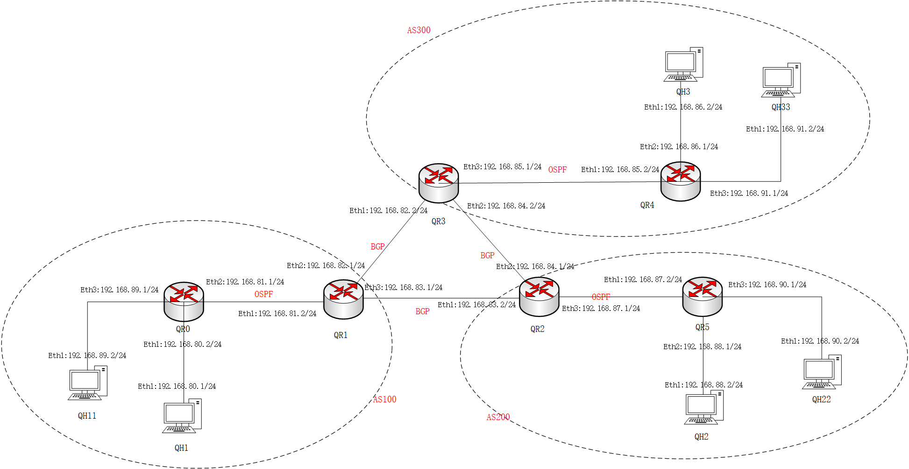

## 一. 概述

能够基于现有的网络拓扑图，能够利用`FRR`和`LXC`自动构建相应的网络拓扑，测试网络拓扑图如下

## 二. 思路

1. 根据网络拓扑图，写出对应的`XML`网络描述文件
2. 根据`XML`网络描述文件以及其数量，转化为类对象存入数据库中，并且生成对应的`LXD`容器
3. 读取`XML`文件，将其转化为`FRR.config`文件，并且加载到容器中
4. 扫描每个容器的端口，连接网桥
