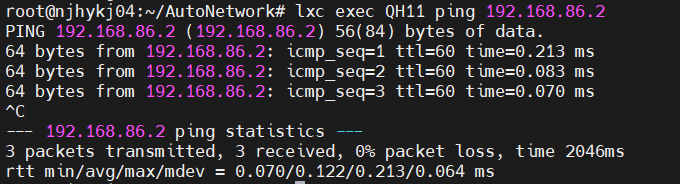

# 自动生成网络

---

## 一. 概述

主要目标是：

1.  理解虚拟网络平台的基于XML描述网络方法，搞清基于XML/FRR生成NFV网络的技术原理；

2. 理解不同厂商路由器的路由协议配置指令，搞清将其转换为自动生成NFV网络的方法；

3. 理解不同厂商路由器ACL指令，研究将其转换为自动配置NFV网络安全策略的方法；

4. 设计实现能够与虚拟网络平台整合的基于网管信息的NFV网络生成VNF，完成系统测试和设计、操作文档；

5. 研究不同厂商路由器其他主要配置指令及其转化方法，实现相关程序。

测试实验拓扑图如下，拓扑图链接：[image.png](https://postimg.cc/KRkySLPL)

## 二. 自动生成网络

### 2.1 思路

---

1. 根据网络拓扑图，写出对应的`XML`网络描述文件
2. 根据`XML`网络描述文件以及其数量，转化为容器类、接口类、协议类对象存入数据库中
3. 从数据库中取出容器类对象，生成对应的`LXD`容器
4. 从数据库中取出容器类对象，创建并且连接网桥
5. 从数据库中取出容器类对象，为每个容器创建接口配置文件
6. 从数据库中取出协议类对象，为每个容器创建网络配置文件
7. 启动所有容器，替换两种配置文件
8. 重启所有的接口以及网络使之生效

### 2.2 生成网络容器展示

---

生成的所有主机容器

生成的所有路由器容器

### 2.3 网络连通性展示

---

利用`QH11`访问任意容器

### 2.4 AS域之间网络连通性展示

---

访问`AS300`，`QH11`访问`QH3`

访问`AS200`，`QH11`访问`QH2`

内部自治域内访问

## 三. 自动部署ACL策略

### 3.1 思路

---

1. 抽象方法，能将中兴或华为的单条`ACL`命令转化为`Iptables`对象
2. 批量处理`ACL`文件，将转化完的`Iptables`对象存入到数据库中
3. 从数据库中取出`Iptables`对象，将其构建为`Iptables`命令配置文件
4. 替换容器中的防火墙配置文件，使之生效

### 3.2 防火墙整体展示

----

生成的`QR1`防火墙

生成的`QR2`防火墙

生成的`QR3`防火墙

### 3.3 测试防火墙性能

---

为了验证单个路由器上防火墙性能，排除其余容器防火墙规则重叠的影响，清空其余容器防火墙

#### 3.3.1 测试QR1

---

验证`QH3`可以连通`QH1`【lxc exec QH3 ping 192.168.80.1】，即验证【permit ip 192.168.86.2 0.0.0.255 any】

验证`QH2`无法连通`QH11`【lxc exec QH2 ping 192.168.89.2】，即验证【deny ip 192.168.88.2 0.0.0.255 any】

查看`QR1`拦截流量情况【lxc exec QR1 -- iptables -t filter -nvL】

#### 3.3.2 测试QR2

---

验证`QH33`可以连通`QH22`【lxc exec QH33 ping 192.168.90.2】，即验证【permit ip 192.168.91.2 0.0.0.255 any】

验证`QH3`可以连通`QH2`【lxc exec QH3 ping 192.168.88.2】，但`QH1`无法连通`QH2`【lxc exec QH1 ping 192.168.88.2】，即验证【permit ip 192.168.86.2 0.0.0.255 any
和deny ip any 255.255.255.255 192.168.88.2 0.0.0.0】，同时还验证了`iptables`的命令具有优先级

查看`QR2`拦截流量情况，【lxc exec QR2 -- iptables -t filter -nvL】

#### 3.3.3 测试QR3

---

验证`QH2`可以连通`QH3`【lxc exec QH2 ping 192.168.86.2】，但`QH22`无法连通`QH3`【lxc exec QH22 ping 192.168.86.2】，即验证【permit ip source 192.168.88.2 0.0.0.255和deny ip source 192.168.90.2 0.0.0.255】，同时验证`iptables`只和规则有关，和`AS`域无关

验证`QH11`无法连通`QH33`【lxc exec QH11 ping 192.168.91.2】，即验证【deny ip source 192.168.89.2 0.0.0.255】

查看`QR3`拦截流量情况

